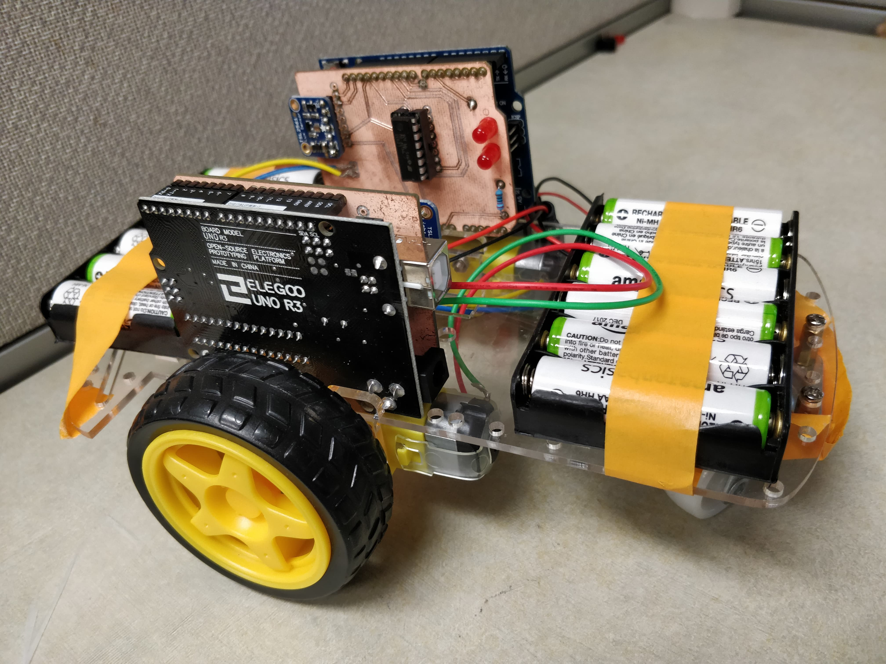
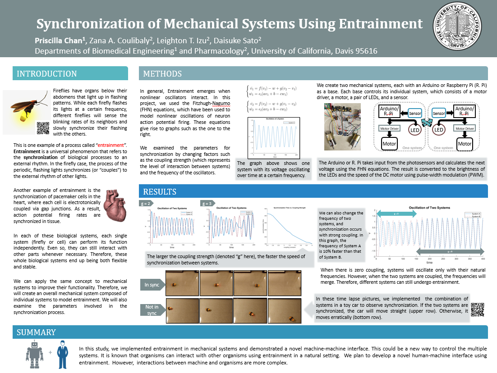
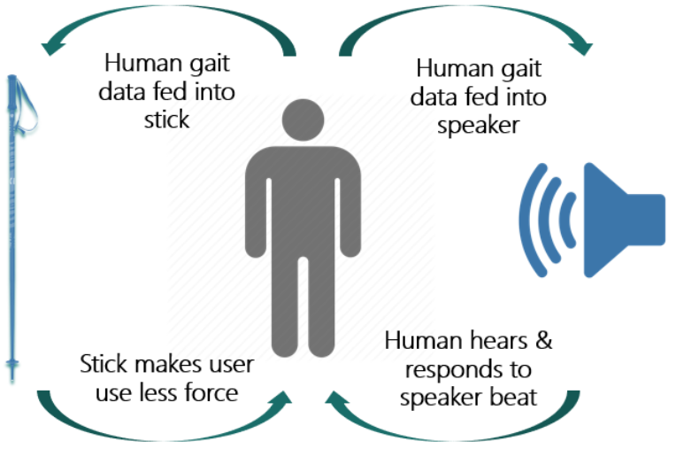
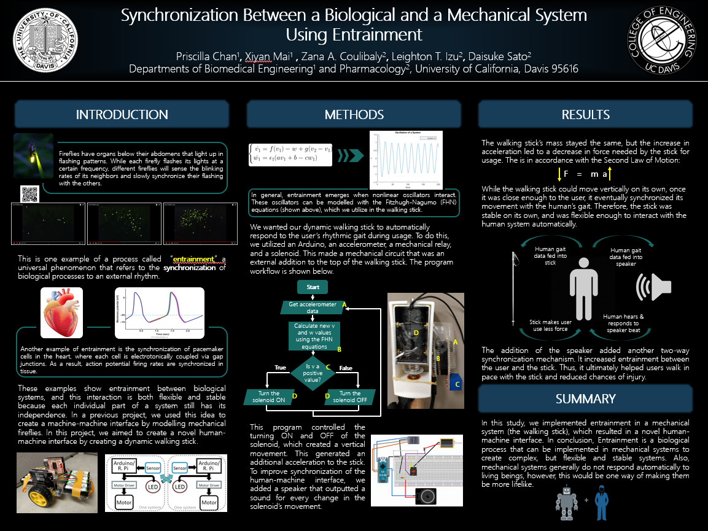

# Synchronization in Mechanical and Biological Systems
In Sato Lab, also known as Theoretical Cardiology Lab, one area of interest is researching how to make mechanical systems more lifelike. There are two main traits that biological systems are created with: `intellect` and `emotion`. If these two traits can be implemented in mechanical systems, then machines will become one step closer to becoming more like biological systems.

Some members of the lab work on implementing `artificial intellect` in mechanical systems by working on image recognition with machine learning. My team works on implementing a form of `artificial emotion` in machines by utilizing a natural phenomena called `entrainment`. 

# Table of Contents
- [Background](#bg)
- [Phases](#phases)
- [Entrainment in Mechanical Fireflies](#fireflies)
- [Making a Machine-Machine Interface](#machine)
- [Making a Human-Machine Interface](#human)
- [Notes](#notes)

# Background
`Entrainment` is a process of external synchronization. An example includes the synchronizing of flashing firefly lights between neighboring fireflies. Another example includes the synchronous beating of pacemaker cells in the heart. By using this phenomena, we can implement a kind of artificial emotion in machines.

An example of emotion in a biological system is when a dog is in the same room as you. If the dog wags its tail, you can feel the dog's happiness from across the room, even if you are not looking at the dog. Because of the dog's happiness, the emotion might affect you and even cause you to smile and be happy. In turn, your happiness might also cause the dog to wag its tail faster in happiness.

We want to implement the same idea: we want a mechanical system to be able to sense another system's "emotion" and automatically generate a response. This is why we want a kind of synchrony effect, and since it happens naturally in `entrainment`, the goal is to utilize this phenomena as our foundation of this project.

# Phases
This project is composed of three phases:
1. Entrainment in Mechanical Fireflies
2. Making a Machine-Machine Interface
3. Making a Human-Machine Interface

# Entrainment in Mechanical Fireflies
A total of six people started on this project to research how to implement entrainment between mechanical systems. We found that with the FitzHugh-Nagumo equations, which are used to model the beating of pacemaker cells in the heart, we can achieve our goal.

The [code](mechanical-fireflies/calibme_C.py) was programmed using Python, and the mechanical systems we built were modeled after fireflies. We utilized Raspberry Pi, LEDs, resistors, and a photosensor to represent one firefly system. Once we implemented entrainment in a system, we put multiple systems together in a dark room and observed the result:

Using this project, we found some key factors for entrainment to occur between systems:
- individual systems do not need to be identical for entrainment to occur
- frequency difference and offset can be corrected for
- only requirement: some level of coupling (synchronization) between the systems

# Making a Machine-Machine Interface
Three people worked on this project to take a step further from the mechanical firefly project. This idea was to see if the synchrony between two mechanical systems can generate a large, single effect.

To do this, we utilized Arduino Unos, printed circuit boards (PCBs), the same firefly system from the mechanical firefly project, some DC motors and wheels attached to a toy car chassis. Since we changed to using Arduinos instead of Raspberry Pis, we had to program a [new code](machine-machine/motorsFHN.ino) in C or C++. The result looked like this:

The idea for this project was to have the two firefly systems synchronize with each other, but with each flash of one firefly, the corresponding wheel of the toy car will turn. Therefore, the large effect is that the car will either:
- move erratically due to no synchronization between the firefly systems on top of the car
- move in a straight line due to synchronization between the firefly systems on top of the car

This project was presented to the public at the 2018 Annual UC Davis Undergraduate Research Conference:

# Making a Human-Machine Interface
Three people worked on this project to see if entrainment in mechanical systems can enable machines to influence and respond to biological systems. This idea was to create a dynamic walking stick that would have a vertical movement that could be influenced by the user's walking rhythm. In turn, the up and down movement from the stick would output a beating rhythm from a speaker, thus influencing the user's gait.

To create the dynamic walking stick, we used a basic walking stick and added an external component to the stick that was composed of an Arduino Nano, a PCB, a relay, a solenoid, and circuitry components. The [code](human-machine/_8ChannelWithFHN_Speaker.ino) was programmed in C++ or C.

[Here is an early prototype demo of the walking stick in use.](human-machine/stick_demo.mp4) The demo was also shown at the 2019 Annual UC Davis Undergraduate Research Conference:

# Notes
- This project started in March 2018 and is currently still ongoing
- This project is currently on Phase 3
- Currently, the main points of contact for this project are: \
Xiyan (Henry) Mai: hxmai@ucdavis.edu \
Priscilla Chan: pychan@ucdavis.edu \
Professor Daisuke Sato: dsato@ucdavis.edu

This README was last updated September 22, 2019.